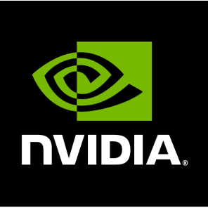

<!-- PROJECT SHIELDS -->
<!--
*** I'm using markdown "reference style" links for readability.
*** Reference links are enclosed in brackets [ ] instead of parentheses ( ).
*** See the bottom of this document for the declaration of the reference variables
*** for contributors-url, forks-url, etc. This is an optional, concise syntax you may use.
*** https://www.markdownguide.org/basic-syntax/#reference-style-links
-->
<div align="left">

[![Contributors][contributors-shield]][contributors-url]
[![Forks][forks-shield]][forks-url]
[![Stargazers][stars-shield]][stars-url]

</div>

<a href="https://github.com/Kaweees/isaacsim">
   
</a>

<div align="left">
  <h1><em><a href="https://github.com/Kaweees/isaacsim">~isaacsim</a></em></h1>
</div>

<!-- ABOUT THE PROJECT -->

A template for developing production-ready robotics applications on [NVIDIA Isaac Sim](https://developer.nvidia.com/isaac/sim).

### Built With

[![Isaac Sim][Isaac-Sim-shield]][Isaac-Sim-url]
[![ROS2][ROS2-shield]][ROS2-url]
[![C++][C++-shield]][C++-url]
[![Python][Python-shield]][Python-url]

<!-- GETTING STARTED -->

## Getting Started

### Prerequisites

Before attempting to build this project, make sure you have [Nix](https://nixos.org/download.html) with [Flake](https://nixos.wiki/wiki/Flakes) support installed on your machine.

### Installation

To get a local copy of the project up and running on your machine, follow these simple steps:

1. Clone the project repository

   ```sh
   git clone https://github.com/Kaweees/isaacsim.git
   cd isaacsim/
   ```

2. Install the project dependencies

   ```sh
   nix-shell --max-jobs $(nproc) # Linux / Windows (WSL)
   nix-shell --max-jobs $(sysctl -n hw.ncpu) # macOS
   ```

3. Run the project

   ```sh
   uv run python scripts/rsl_rl/train.py --task=Isaac-Velocity-Rough-Unitree-Go2-v0 --num_envs 4096 --headless --video --enable_cameras --logger=tensorboard
   uv run tensorboard --logdir logs/rsl_rl/unitree_go2_rough
   ```
   ```sh
   uv run python scripts/rsl_rl/play.py --task=Isaac-Velocity-Rough-Unitree-Go2-v0 --num_envs 4096 --headless --video --enable_cameras --logger=tensorboard --output_name=model --export_onnx --export_jit
   ```

<!-- PROJECT FILE STRUCTURE -->

## Project Structure

```sh
isaacsim/
├── .github/                       - GitHub Actions CI/CD workflows
├── scripts/                       - Standalone scripts
├── shared/
│   └── utils/                     - Shared utility functions
├── src/                           - Project packages
│   ├── core/                      - Core application logic
│   └── ...                        - Other packages
├── LICENSE                        - project license
└── README.md                      - you are here
```

## License

The source code for [Kaweees/isaacsim](https://github.com/Kaweees/isaacsim) is distributed under the terms of the MIT License, as I firmly believe that collaborating on free and open-source software fosters innovations that mutually and equitably beneficial to both collaborators and users alike. See [`LICENSE`](./LICENSE) for details and more information.

<!-- MARKDOWN LINKS & IMAGES -->
<!-- https://www.markdownguide.org/basic-syntax/#reference-style-links -->
[contributors-shield]: https://img.shields.io/github/contributors/Kaweees/isaacsim.svg?style=for-the-badge
[contributors-url]: https://github.com/Kaweees/isaacsim/graphs/contributors
[forks-shield]: https://img.shields.io/github/forks/Kaweees/isaacsim.svg?style=for-the-badge
[forks-url]: https://github.com/Kaweees/isaacsim/network/members
[stars-shield]: https://img.shields.io/github/stars/Kaweees/isaacsim.svg?style=for-the-badge
[stars-url]: https://github.com/Kaweees/isaacsim/stargazers

<!-- MARKDOWN SHIELD BAGDES & LINKS -->
<!-- https://github.com/Ileriayo/markdown-badges -->
[Isaac-Sim-shield]: https://img.shields.io/badge/NVIDIA%20Isaac%20Sim-%23008080.svg?style=for-the-badge&logo=nvidia&logoColor=76B900&labelColor=222222&color=76B900
[Isaac-Sim-url]: https://developer.nvidia.com/isaac/sim
[ROS2-shield]: https://img.shields.io/badge/ROS2-%23008080.svg?style=for-the-badge&logo=ros&logoColor=22314E&labelColor=222222&color=22314E
[ROS2-url]: https://www.ros.org/
[C++-shield]: https://img.shields.io/badge/C++-%23008080.svg?style=for-the-badge&logo=c%2B%2B&logoColor=004482&labelColor=222222&color=004482
[C++-url]: https://isocpp.org/
[Python-shield]: https://img.shields.io/badge/Python-%23008080.svg?style=for-the-badge&logo=python&logoColor=FFDD54&labelColor=222222&color=306998
[Python-url]: https://www.python.org/
